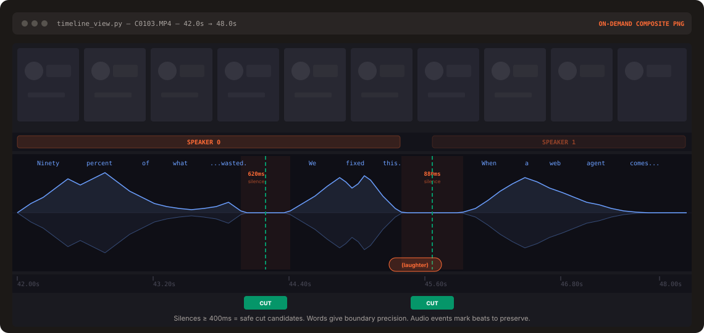

<p align="center">
  
</p>

# freecut

**freecut** is a fork of [browser-use/video-use](https://github.com/browser-use/video-use) with the paid ElevenLabs Scribe dependency replaced by free, pluggable transcription backends. Edit videos with Claude Code, 100% open source, zero required API keys.

Drop raw footage in a folder, chat with Claude Code, get `final.mp4` back. Works for any content — talking heads, montages, tutorials, travel, interviews — without presets or menus.

## What's different from `video-use`

`video-use` is great but hard-required a paid ElevenLabs Scribe API key. `freecut` refactors the transcription layer into a pluggable backend and ships free defaults:

| Backend      | Cost | Speakers | Runs on Mac? | Trigger                                       |
|--------------|------|----------|--------------|-----------------------------------------------|
| `whisper`    | Free | 1 (fixed)| ✅ Local     | Default. `mlx-whisper` or `faster-whisper`.   |
| `vibevoice`  | GPU cost | N (real diarization) | ❌ CUDA-only | Set `VIBEVOICE_ASR_URL`, pass `--backend vibevoice`. |
| `elevenlabs` | Paid | N (Scribe diarization) | ✅ (cloud) | Set `ELEVENLABS_API_KEY`, pass `--backend elevenlabs`. |

Everything downstream (`pack_transcripts.py`, `render.py`, EDL generation, the SKILL) is untouched — each backend emits the same `{"words": [...]}` shape.

## What it does

- **Cuts out filler words** (`umm`, `uh`, false starts) and dead space between takes
- **Auto color grades** every segment (warm cinematic, neutral punch, or any custom ffmpeg chain)
- **30ms audio fades** at every cut so you never hear a pop
- **Burns subtitles** in your style — 2-word UPPERCASE chunks by default, fully customizable
- **Generates animation overlays** via [HyperFrames](https://github.com/heygen-com/hyperframes), [Remotion](https://www.remotion.dev/), [Manim](https://www.manim.community/), or PIL — spawned in parallel sub-agents, one per animation
- **Self-evaluates the rendered output** at every cut boundary before showing you anything
- **Persists session memory** in `project.md` so next week's session picks up where you left off

## Setup prompt

Paste into Claude Code, Codex, Hermes, Openclaw, or any agent with shell access:

```text
Set up https://github.com/Moh4696/freecut for me.

Read install.md first to install this repo, wire up ffmpeg, register the skill
with whichever agent you're running under, and install a local Whisper backend
(mlx-whisper on Apple Silicon, otherwise faster-whisper). No API keys are
required — transcription runs locally. Then read SKILL.md for daily usage,
and always read helpers/ because that's where the editing scripts live.
After install, don't transcribe anything on your own — just tell me it's ready
and wait for me to drop footage into a folder.
```

Then point your agent at a folder of raw takes:

```bash
cd /path/to/your/videos
claude    # or codex, hermes, etc.
```

And in the session:

> edit these into a launch video

It inventories the sources, proposes a strategy, waits for your OK, then produces `edit/final.mp4` next to your sources. All outputs live in `<videos_dir>/edit/` — the skill directory stays clean.

## Manual install

```bash
# 1. Clone and symlink into your agent's skills directory
git clone https://github.com/Moh4696/freecut ~/Developer/freecut
ln -sfn ~/Developer/freecut ~/.claude/skills/freecut          # Claude Code
# ln -sfn ~/Developer/freecut ~/.codex/skills/freecut         # Codex

# 2. Install core deps
cd ~/Developer/freecut
uv sync                                          # or: pip install -e .

# 3. Install a Whisper backend (pick one)
uv pip install mlx-whisper                       # Apple Silicon — fastest
# uv pip install faster-whisper                  # everywhere else

# 4. System deps
brew install ffmpeg                              # required
brew install yt-dlp                              # optional, for URL sources
```

That's it — no `.env` needed for the default `whisper` backend.

### Optional: multi-speaker diarization with VibeVoice-ASR

`whisper` is single-speaker. For true "Who/When/What" diarization, use `--backend vibevoice`. The [microsoft/VibeVoice-ASR](https://huggingface.co/microsoft/VibeVoice-ASR) model is CUDA-only, so freecut talks to it over HTTP — point at a rented GPU box, a Modal/RunPod deploy, or an Azure AI Foundry endpoint:

```bash
cp .env.example .env
echo "VIBEVOICE_ASR_URL=https://your-endpoint/transcribe" >> .env

python helpers/transcribe_batch.py /path/to/videos --backend vibevoice
```

The endpoint just needs to accept a multipart `file=<wav>` POST and return VibeVoice's segment JSON (or the normalized `{"words":[…]}` shape); see [`helpers/transcribe.py`](helpers/transcribe.py) for the exact contract.

### Optional: original ElevenLabs Scribe backend

If you already have an ElevenLabs key and want Scribe's specific output:

```bash
echo "ELEVENLABS_API_KEY=sk-..." >> .env
python helpers/transcribe_batch.py /path/to/videos --backend elevenlabs
```

## How it works

The LLM never watches the video. It **reads** it — through two layers that together give it everything it needs to cut with word-boundary precision.

<p align="center">
  
</p>

**Layer 1 — Audio transcript (always loaded).** One transcription call per source gives word-level timestamps and (optionally) speaker diarization. All takes pack into a single ~12KB `takes_packed.md` — the LLM's primary reading view.

```
## C0103  (duration: 43.0s, 8 phrases)
  [002.52-005.36] S0 Ninety percent of what a web agent does is completely wasted.
  [006.08-006.74] S0 We fixed this.
```

**Layer 2 — Visual composite (on demand).** `timeline_view` produces a filmstrip + waveform + word labels PNG for any time range. Called only at decision points — ambiguous pauses, retake comparisons, cut-point sanity checks.

> Naive approach: 30,000 frames × 1,500 tokens = **45M tokens of noise**.
> freecut: **12KB text + a handful of PNGs**.

Same idea as browser-use giving an LLM a structured DOM instead of a screenshot — but for video.

## Pipeline

```
Transcribe ──> Pack ──> LLM Reasons ──> EDL ──> Render ──> Self-Eval
                                                              │
                                                              └─ issue? fix + re-render (max 3)
```

The self-eval loop runs `timeline_view` on the _rendered output_ at every cut boundary — catches visual jumps, audio pops, hidden subtitles. You see the preview only after it passes.

## Design principles

1. **Text + on-demand visuals.** No frame-dumping. The transcript is the surface.
2. **Audio is primary, visuals follow.** Cuts come from speech boundaries and silence gaps.
3. **Ask → confirm → execute → self-eval → persist.** Never touch the cut without strategy approval.
4. **Zero assumptions about content type.** Look, ask, then edit.
5. **12 hard rules, artistic freedom elsewhere.** Production-correctness is non-negotiable. Taste isn't.

See [`SKILL.md`](./SKILL.md) for the full production rules and editing craft.

## Credits

- Base tool: [browser-use/video-use](https://github.com/browser-use/video-use) (MIT)
- Local ASR: [OpenAI Whisper](https://github.com/openai/whisper), [mlx-whisper](https://github.com/ml-explore/mlx-examples/tree/main/whisper), [faster-whisper](https://github.com/SYSTRAN/faster-whisper)
- Diarization backend: [microsoft/VibeVoice-ASR](https://huggingface.co/microsoft/VibeVoice-ASR) (MIT)
